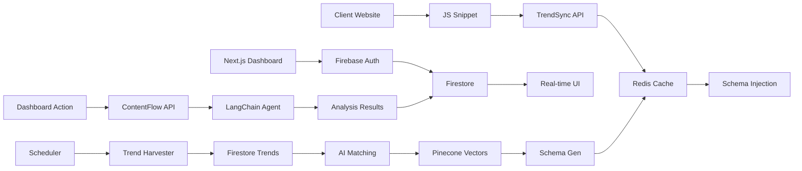

# 🚀 TrendSync & ContentFlow - Development Guide

## 🏗️ Architecture Overview

### Tech Stack

```
📱 FRONTEND (Next.js + Firebase)
├── Framework: Next.js 14 (App Router)
├── Hosting: Firebase Hosting
├── Auth: Firebase Authentication
├── Database: Firestore (Client-side)
├── Styling: Tailwind CSS + Shadcn/UI
└── Language: TypeScript

⚙️ BACKEND SERVICES (Cloud Run)
├── TrendSync API: Node.js + Express
├── ContentFlow API: Python + FastAPI
├── Orchestration: Cloud Run + Docker
├── Cache: Redis
└── Vector DB: Pinecone

🗄️ DATA LAYER
├── Primary: Firestore
├── Cache: Redis
├── Vector: Pinecone
└── File Storage: Google Cloud Storage
```

### System Flow



## 👥 Development Teams & Responsibilities

### Team A: TrendSync (Dynamic SEO)

**Tech Stack:** Node.js, Redis, Firestore, Cloud Run

#### Core Responsibilities:

1. **Universal JS Snippet** (`loader.js`)
2. **TrendSync API** (Cloud Run - Node.js)
3. **Trend Harvester** (Cloud Functions)
4. **Schema Generation & Caching**
5. **Real-time Injection System**

#### Dependencies Needed from ContentFlow:

* ✅ Access to shared Firestore `trends` collection
* ✅ Content analysis patterns (for schema optimization)
* ❌ No direct LangChain dependency

#### Development Steps:

```bash
# Phase 1: Foundation
1. Setup TrendSync Cloud Run service (Node.js/Express)
2. Create Firestore schema for clients/crawls/trends
3. Develop universal JS snippet loader

# Phase 2: Core Features
4. Build trend harvester (Cloud Functions)
5. Implement schema generation engine
6. Add Redis caching layer

# Phase 3: Integration
7. Connect to Firestore trends collection
8. Implement real-time API endpoints
9. Add performance monitoring
```

---

### Team B: ContentFlow (AI Content Strategy)

**Tech Stack:** Python, LangChain, Pinecone, FastAPI

#### Core Responsibilities:

1. **ContentFlow API** (Cloud Run - Python)
2. **LangChain Agent & Tools**
3. **Vector DB Management** (Pinecone)
4. **Content Analysis Engine**
5. **Strategic Recommendations**

#### Dependencies Needed from TrendSync:

* ✅ Read access to Firestore `clients` collection
* ✅ Access to `crawls` data for content analysis
* ✅ Trend data from `trends` collection
* ❌ No direct Redis or JS snippet dependency

#### Development Steps:

```bash
# Phase 1: Foundation
1. Setup ContentFlow Cloud Run service (Python/FastAPI)
2. Configure Pinecone vector database
3. Create LangChain agent framework

# Phase 2: Core Features
4. Build content gap analysis tools
5. Implement trend-content matching
6. Develop link suggestion engine

# Phase 3: Integration
7. Connect to Firestore clients/crawls
8. Create dashboard API endpoints
9. Add real-time suggestion streaming
```

---

## 🔗 Integration Points

### Shared Firestore Collections

```javascript
// Team A (TrendSync) WRITES, Team B (ContentFlow) READS
trends/{id} = {
  query: string,
  volume: number,
  timestamp: Date,
  category: string
}

// Team A WRITES, Team B READS
crawls/{id} = {
  clientId: string,
  pages: array,
  content: map,
  status: string
}

// Team A & B BOTH READ/WRITE (different fields)
clients/{id} = {
  // Team A fields:
  domain: string,
  clientKey: string,
  crawlStatus: string,
  
  // Team B fields:
  contentGaps: array,
  linkSuggestions: array,
  strategyScore: number
}
```

---

### API Contracts

#### TrendSync API (Team A)

```javascript
// GET /api/schema - For JS snippet
GET /v1/schema?clientKey=abc123&url=https://example.com
Response: { schema: JSON-LD, cached: boolean }

// POST /api/crawl - Initiate site crawl
POST /v1/clients/{clientId}/crawl
Response: { crawlId: string, status: string }

// Internal: Trend processing
POST /internal/process-trends
// Called by Cloud Function scheduler
```

#### ContentFlow API (Team B)

```javascript
// POST /api/analyze/content-gaps - From dashboard
POST /v1/analyze/content-gaps
Body: { clientId: string, depth: 'quick' | 'deep' }
Response: { gaps: array, opportunities: array }

// GET /api/suggestions - Real-time updates
GET /v1/suggestions/{clientId}
Response: { links: array, content: array }

// Internal: Vector DB management
POST /internal/update-embeddings
// Called when new content is crawled
```

---

## 🛠️ Development Setup

### Team A - TrendSync Setup

```bash
# 1. Clone repo
git clone [repo-url]
cd packages/trendsync-service

# 2. Install dependencies
npm install

# 3. Environment setup
cp .env.example .env
# Add: FIRESTORE_CONFIG, REDIS_URL, GCP_CREDENTIALS

# 4. Local development
npm run dev
# API runs on http://localhost:3001

# 5. Deployment
npm run deploy:staging
```

### Team B - ContentFlow Setup

```bash
# 1. Clone repo
git clone [repo-url]
cd packages/contentflow-service

# 2. Setup Python environment
python -m venv venv
source venv/bin/activate  # or venv\Scripts\activate on Windows

# 3. Install dependencies
pip install -r requirements.txt

# 4. Environment setup
cp .env.example .env
# Add: FIRESTORE_CONFIG, PINECONE_API_KEY, OPENAI_API_KEY

# 5. Local development
python main.py
# API runs on http://localhost:8001

# 6. Deployment
./deploy.sh
```

---

## 📋 3-Week Sprint to Production

### 🎯 Goal: Both systems client-ready by Week 3

### Week 1: Foundation & Setup

**Team A - TrendSync:**
* [ ] Day 1-2: Cloud Run service + Express API skeleton
* [ ] Day 3-4: Firestore schema (clients/crawls/trends)
* [ ] Day 5-7: Universal JS snippet + basic schema injection

**Team B - ContentFlow:**
* [ ] Day 1-2: FastAPI service + Pinecone setup
* [ ] Day 3-4: LangChain agent framework
* [ ] Day 5-7: Basic content gap analysis tool

**Shared:**
* [ ] API authentication mechanism agreed
* [ ] Firestore data models finalized
* [ ] Docker containers for local development

### Week 2: Core Features & Integration

**Team A - TrendSync:**
* [ ] Day 8-10: Trend harvester (Cloud Functions)
* [ ] Day 11-12: Redis caching layer
* [ ] Day 13-14: Real-time schema generation + API endpoints

**Team B - ContentFlow:**
* [ ] Day 8-10: Vector embedding pipeline
* [ ] Day 11-12: Trend-content matching engine
* [ ] Day 13-14: Dashboard API endpoints + streaming

**Shared:**
* [ ] Team A provides sample trend data in Firestore
* [ ] Team B reads from shared collections
* [ ] Integration testing begins

### Week 3: Polish & Client Deployment

**Team A - TrendSync:**
* [ ] Day 15-16: Performance optimization + monitoring
* [ ] Day 17-18: Client onboarding flow
* [ ] Day 19-21: Production deployment + testing

**Team B - ContentFlow:**
* [ ] Day 15-16: Link suggestion engine complete
* [ ] Day 17-18: Dashboard UI integration
* [ ] Day 19-21: Production deployment + testing

**Shared:**
* [ ] End-to-end testing with real client data
* [ ] Load testing and performance validation
* [ ] Documentation and handoff materials
* [ ] ✅ BOTH SYSTEMS CLIENT-READY

---

## 🚨 Critical Dependencies & Handoffs

### Team A → Team B Dependencies:

1. **Firestore Trends Collection** – Week 1, Day 7
2. **Client Crawl Data** – Week 2, Day 10
3. **API Authentication** – Week 1, Day 3

### Team B → Team A Dependencies:

1. **Content Analysis Patterns** – Week 2, Day 14
2. **Optimization Suggestions** – Week 3, Day 17
3. **Performance Metrics** – Week 3, Day 19


**Both teams work independently but integrate through well-defined APIs and shared data contracts.**
